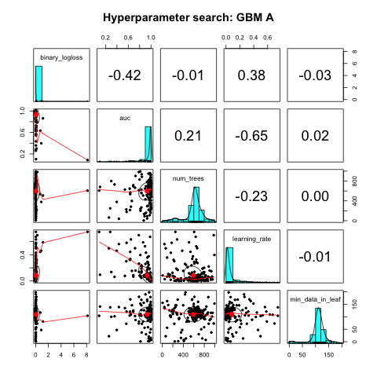
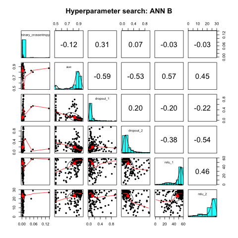
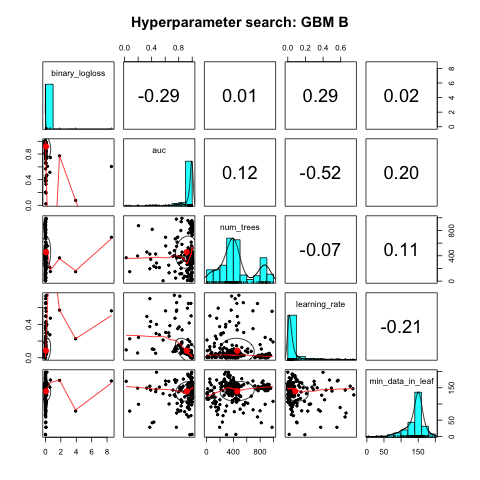
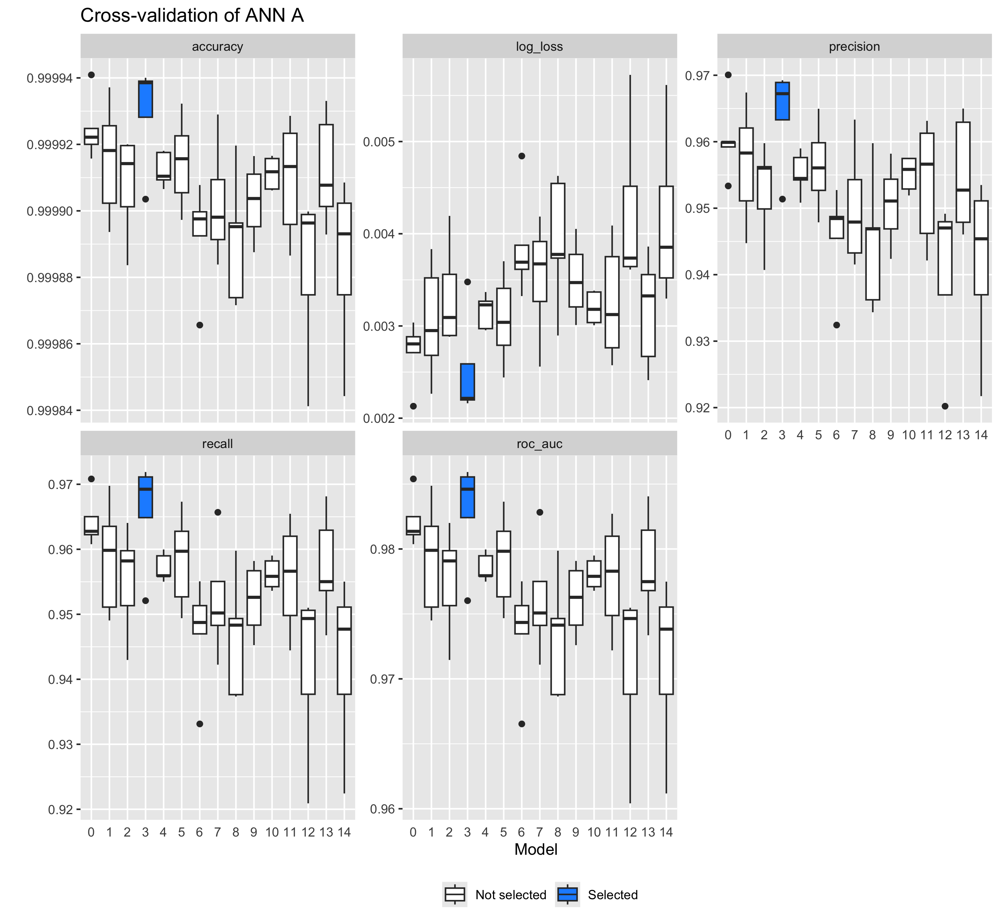
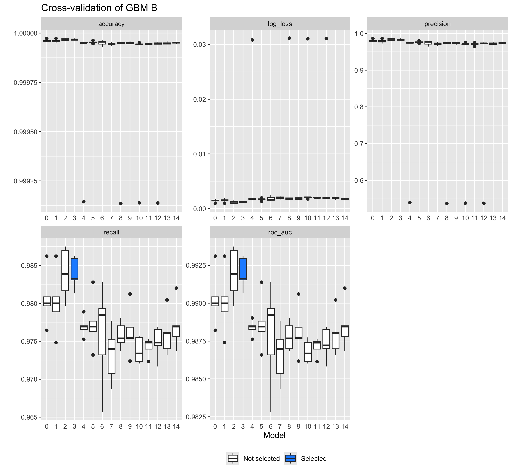
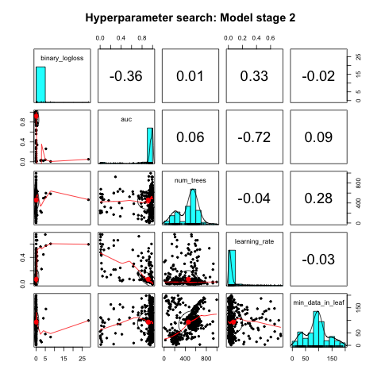

A Cascading Machine Learning Model for FERC and EIA Data Linkage
================
Project by Andrew Bartnof and Alex Engel, Code by Andrew Bartnof
2025

# Introduction

The FERC Form 1 - Electric Utility Annual Report is a “comprehensive
financial and operating report submitted for Electric Rate regulation
and financial audits”
([ferc.gov](https://www.ferc.gov/general-information-0/electric-industry-forms/form-1-1-f-3-q-electric-historical-vfp-data)).
Every year, power plant operators are obliged to fill out this form, and
summarize their power plants’ operations. There is little, if any,
validation for these forms, and no consistent identifiers beyond the one
for the reporting entity.

Likewise, each year, the EIA puts out a series of datasets (forms 860
and 923) which describe the power plants in operation in the nation. In
contrast, EIA forms involve a review and validation process and use
internally consistent identifiers for utilities, power plants,
generators, and other items reported in EIA forms.

Regrettably, there is no common ID that can be used to look up a single
power plant in both the FERC and EIA records. The FERC forms are
completed manually by the power plant operators, while the EIA is
completed by administrators at the federal government. Consequently,
even if these two forms refer to the same power plant by name, they can
differ in all sorts of ways. A few examples of how these records can
*nearly* align and make data-linkages really hard for a computer:

- The FERC entry can have a typo; the FERC entry can refer to the new
  corporate owners while the EIA one refers to the old ones

- The FERC entry can do something like clustering plants I through IX,
  while the EIA doesn’t cluster plants and doesn’t use roman numerals

- The FERC entry can refer to an entire facility, while the EIA records
  refer to a distinct component of the facility.

…and so forth.

A single FERC entry could be matched to a single EIA entry in a few
minutes, if you’re doing it by hand. But there are thousands of entries
to go through, and every year brings more.

# A Cascading Machine-Learning Solution

Our process required comparing two things. First each hand-written FERC
power plant record that could represent, at the discretion of the
utility and form-filer, a single generator at a power plant, an
arbitrary collection of generators at a power plant, or a whole power
plant (we refer to these various aggregations as “plant parts”). And the
second, a set of EIA power plant data aggregations constructed to
correspond with those possible plant parts used by FERC respondents. The
only blocking rule that we imposed was that they had to refer to the
same calendar year.

We’ve designed a set of machine-learning models that can essentially
mimic the ways in which a human would match these by hands. Our model
looks at each FERC entry individually, just like a human would, and
compares it to all of the EIA entries that it *could* link to. The only
blocking rule that we imposed was that they had to refer to the same
calendar year. Finally, our model gives a probability for each FERC
entry and all possible EIA entries for that year– the FERC:EIA linkage
with the highest probability wins, and is our preferred match. Easy!

For our FERC and EIA input files, we use the Catalist-Coop PUDL datasets
([PUDL](https://github.com/catalyst-cooperative/pudl/?tab=readme-ov-file)).
Cleverly, Catalist-Coop has broken out each EIA entity into its
constituent parts– so, for a given EIA plant, we can also recognize each
generator therein as a separate row, and a possible match. We then
compare each FERC entry to every possible broken out EIA record. This
means that for each FERC entry, we are matching against (the number of
plants in the nation for that year) x (the number of ways in which the
parts of said plants can be broken out)– a very large number.

We designed two feature encodings that represented two different ways of
thinking about this problem: in encoding A, we focused on the kinds of
proper nouns that a human might focus on. In encoding B, in contrast, we
focused on the kinds of technical metrics that effectively describe the
plant’s structure and performance. Then, for each feature encoding, we
fit both an artificial neural network, and a gradient boosting model
(using Keras/Tensorflow, and LightGBM, respectively).

Stage 1 Models:

- Model A, Artificial Neural Network

- Model A, Gradient Boosting Model

- Model B, Artificial Neural Network

- Model B, Gradient Boosting Model

Finally, we fit a second-stage model, a gradient boosting model, which
takes all of the above data (the input data for each model, as well as
each model’s fitted values), and judges which match between FERC and EIA
records is most probable.

Stage 2 Model:

- Gradient Boosting Model

We have had very good results from this architecture. Our
goodness-of-fit metrics exceeds existing data-linkage options, and
generally mimics the kinds of choices we would make manually.

# Hyperparameter Search

The neural network models each had 2 hidden layers, with dropout in
order to avoid overfit. All of the models were trained in the same
general way: we used the RayTune package, using the Optuna optimizer, to
perform an initial hyper-parameter search, using a 4/5 of the data for
training, and 1/5 as testing. The results of these hyper-parameter
searches can be seen here:

From this list of tested hyper-parameters, we selected the most
promising hyper-parameter options, and we performed five-fold
cross-validation on them (80% of the data is used to train a model, and
20% is used to test). Finally, we manually looked at the virtues and
shortcomings of each cross-validated option, and chose the
hyper-parameters we liked best. The results of these cross-validations
can be seen here:

<figure>

<figcaption aria-hidden="true"></figcaption>
</figure>

Interestingly enough, even though each of the 1st stage models performed
admirably, if we compared their responses to each other, we found that
their responses didn’t correlate very highly!

<figure>

<figcaption aria-hidden="true">Median correlation of each stage 1
model’s fitted values</figcaption>
</figure>

This was highly reassuring that a cascade architecture was the way to
go. The stage 2 model would be a GBM. In our model, each of the initial
four models gives its fitted values; then, we feed those fitted values,
along with some characteristics about the FERC entries in question, into
a second-tier model, which gives us our final linkages.

While all of the metrics on the stage 1 models are based on normal
5-fold cross validation (4 folds for training, 1 for testing), for the
stage 2 models, 2/5 of the data was held for stage 1 model training; 2/5
for stage 2 model training/ and 1/5 for stage 2 model validation.
Consequently, the stage 2 model was actually evaluated based on a model
fit on half as many data. We have no doubt that this gives us an
extremely conservative set of goodness-of-fit metrics; the final model,
which is fit on the entire dataset, should perform even better.

All of the above scripts can be run from within pixi, a package
management tool. Please note that for every python file, there is both a
jupyter notebook, which is handy for doing interactive work, and a
derived .~py file, which can just be run from terminal. Consequently,
we’re only listing the .~py files in this workflow.

Also please note that at the top of each script, there is a reference to
a directory, **data\\dir**. This is a reference to where you place your
working files (eg. on an external harddrive, in your Documents folder,
etc). Please change the referent location for **data\\dir** to wherever
your project is located.

The files should be run in the following order:

| section                         | file \#   | directory                                | filename                                                         | description                                                                                                                                                          |
|---------------------------------|-----------|------------------------------------------|------------------------------------------------------------------|----------------------------------------------------------------------------------------------------------------------------------------------------------------------|
| General Scripts                 | 1         | general_scripts                          | collect_data.R                                                   | Collect FERC and EIA tables from the Catalyst Co-op pudl sqlite file                                                                                                 |
| General Scripts                 | 2         | general_scripts                          | clean_positive_matches.R                                         | Load the ground-truth mappings from FERC:EIA; ensure that every row in it is something that we can use in this model                                                 |
| General Scripts                 | 3         | general_scripts                          | create_training_matches_and_mismatches.R                         | First step in creating training dataset: for each ‘ground-truth’ mapping, note several thousand non-valid mappings                                                   |
| General Scripts                 | 4         | general_scripts                          | entire_dataset_cartesian_product_of_ferc_and_eia_ids.R           | For each FERC observation in a given year, note every EIA observation that it could hypothetically be mapped onto; constrain these mappings only by blocking by year |
| Prepare training data, models A | 1         | model_a                                  | model_a_create_comparable_metrics_training.R                     | Compare easily comparable metrics                                                                                                                                    |
| Prepare training data, models A | 2         | model_a                                  | model_a_feature_engineering_training.R                           | Feature engineering                                                                                                                                                  |
| Prepare training data, models A | (not run) | model_a                                  | model_a_create_comparable_metrics_functions.R                    | Establish functions to be sourced when comparing easily-comparable metrics                                                                                           |
| Prepare training data, models A | (not run) | model_a                                  | model_a_feature_engineering_functions.R                          | Establish functions to be sourced for feature engineering                                                                                                            |
| Prepare training data, models B | 1         | model_b                                  | model_b_precreate_comparison_tables.R                            | Perform all of the metrics comparisons that will be noted in the feature engineering                                                                                 |
| Prepare training data, models B | 2         | model_b                                  | model_b_feature_engineering_training.R                           | Feature engineering                                                                                                                                                  |
| Prepare training data, models B | (not run) | model_b                                  | model_b_feature_engineering_functions.R                          | Establish functions to be sourced for feature engineering                                                                                                            |
| Create model A, ANN             | 1         | model_a/model_a_ann/model_a_ann_training | model_a_ann_hyperparameter_search.ipynb                          | Perform an initial search for optimal hyperparameters                                                                                                                |
| Create model A, ANN             | 1         | model_a/model_a_ann/model_a_ann_training | model_a_ann_hyperparameter_search.py                             | Perform an initial search for optimal hyperparameters                                                                                                                |
| Create model A, ANN             | 2         | model_a/model_a_ann/model_a_ann_training | model_a_ann_hyperparameter_search_dig_into_best_candidates.ipynb | Perform cross-validation to dig into the most promising hyperparameters                                                                                              |
| Create model A, ANN             | 2         | model_a/model_a_ann/model_a_ann_training | model_a_ann_hyperparameter_search_dig_into_best_candidates.py    | Perform cross-validation to dig into the most promising hyperparameters                                                                                              |
| Create model A, ANN             | 3         | model_a/model_a_ann/model_a_ann_training | model_a_ann_hyperparameter_search_final_metrics_analysis.R       | Choose which hyperparameters from the cross-validation to use for the final model                                                                                    |
| Create model A, ANN             | 4         | model_a/model_a_ann/model_a_ann_training | model_a_ann_fit.ipynb                                            | Fit model                                                                                                                                                            |
| Create model A, ANN             | 4         | model_a/model_a_ann/model_a_ann_training | model_a_ann_fit.py                                               | Fit model                                                                                                                                                            |
| Create model A, GBM             | 1         | model_a/model_a_gbm/model_a_gbm_training | model_a_gbm_hyperparameter_search.ipynb                          | Perform an initial search for optimal hyperparameters                                                                                                                |
| Create model A, GBM             | 1         | model_a/model_a_gbm/model_a_gbm_training | model_a_gbm_hyperparameter_search.py                             | Perform an initial search for optimal hyperparameters                                                                                                                |
| Create model A, GBM             | 2         | model_a/model_a_gbm/model_a_gbm_training | model_a_gbm_hyperparameters_search_2_cv.ipynb                    | Perform cross-validation to dig into the most promising hyperparameters                                                                                              |
| Create model A, GBM             | 3         | model_a/model_a_gbm/model_a_gbm_training | model_a_train_rank_hyperparameters.R                             | Choose which hyperparameters from the cross-validation to use for the final model                                                                                    |
| Create model A, GBM             | 4         | model_a/model_a_gbm/model_a_gbm_training | model_a_gbm_fit.ipynb                                            | Fit model                                                                                                                                                            |
| Create model A, GBM             | 4         | model_a/model_a_gbm/model_a_gbm_training | model_a_gbm_fit.py                                               | Fit model                                                                                                                                                            |
| Create model B, ANN             | 1         | model_b/model_b_ann/model_b_ann_training | model_b_ann_hyperparameter_search.py                             | Perform an initial search for optimal hyperparameters                                                                                                                |
| Create model B, ANN             | 1         | model_b/model_b_ann/model_b_ann_training | model_b_ann_hyperparameter_search.ipynb                          | Perform an initial search for optimal hyperparameters                                                                                                                |
| Create model B, ANN             | 2         | model_b/model_b_ann/model_b_ann_training | model_b_ann_hyperparameter_search_dig_into_best_candidates.ipynb | Perform cross-validation to dig into the most promising hyperparameters                                                                                              |
| Create model B, ANN             | 2         | model_b/model_b_ann/model_b_ann_training | model_b_ann_hyperparameter_search_dig_into_best_candidates.py    | Perform cross-validation to dig into the most promising hyperparameters                                                                                              |
| Create model B, ANN             | 3         | model_b/model_b_ann/model_b_ann_training | model_b_ann_fit.ipynb                                            | Fit model                                                                                                                                                            |
| Create model B, ANN             | 3         | model_b/model_b_ann/model_b_ann_training | model_b_ann_fit.py                                               | Fit model                                                                                                                                                            |
| Create model B, ANN             | 4         | model_b/model_b_ann/model_b_ann_training | model_b_ann_hyperparameter_search_final_metrics_analysis.R       | Choose which hyperparameters from the cross-validation to use for the final model                                                                                    |
| Create model B, GBM             | 1         | model_b/model_b_gbm/model_b_gbm_training | model_b_gbm_hyperparameter_search.ipynb                          | Perform an initial search for optimal hyperparameters                                                                                                                |
| Create model B, GBM             | 1         | model_b/model_b_gbm/model_b_gbm_training | model_b_gbm_hyperparameter_search.py                             | Perform an initial search for optimal hyperparameters                                                                                                                |
| Create model B, GBM             | 2         | model_b/model_b_gbm/model_b_gbm_training | model_b_gbm_hyperparameters_search_2_cv.ipynb                    | Perform cross-validation to dig into the most promising hyperparameters                                                                                              |
| Create model B, GBM             | 3         | model_b/model_b_gbm/model_b_gbm_training | model_b_gbm_hyperparameters_search_choose_hp.R                   | Choose which hyperparameters from the cross-validation to use for the final model                                                                                    |
| Create model B, GBM             | 4         | model_b/model_b_gbm/model_b_gbm_training | model_b_gbm_fit.ipynb                                            | Fit model                                                                                                                                                            |
| Create model B, GBM             | 4         | model_b/model_b_gbm/model_b_gbm_training | model_b_gbm_fit.py                                               | Fit model                                                                                                                                                            |
| Prepare tranches for models A   | 1         | model_a                                  | model_a_create_comparable_metrics_tranches.R                     | Compare easily comparable metrics                                                                                                                                    |
| Prepare tranches for models B   | 1         | model_b                                  | model_b_feature_engineering_tranches.R                           | Feature engineering                                                                                                                                                  |
| Prepare tranches for models A   | 2         | model_a                                  | model_a_feature_engineering_tranches.R                           | Feature engineering                                                                                                                                                  |
| Predict tranches, models A      | 1         | model_a/model_a_ann/model_a_ann_usage    | model_a_ann_predict.ipynb                                        | Iterate through the tranches’ X files, and return a y_fit for each row, using the model A ANN                                                                        |
| Predict tranches, models A      | 1         | model_a/model_a_ann/model_a_ann_usage    | model_a_ann_predict.py                                           | Iterate through the tranches’ X files, and return a y_fit for each row, using the model A ANN                                                                        |
| Predict tranches, models A      | 2         | model_a/model_a_gbm/model_a_gbm_usage    | model_a_gbm_predict.py                                           | Iterate through the tranches’ X files, and return a y_fit for each row, using the model A GBM                                                                        |
| Predict tranches, models A      | 2         | model_a/model_a_gbm/model_a_gbm_usage    | model_a_gbm_predict.ipynb                                        | Iterate through the tranches’ X files, and return a y_fit for each row, using the model A GBM                                                                        |
| Predict tranches, models B      | 1         | model_b/model_b_ann/model_b_ann_usage    | model_b_ann_predict.py                                           | Iterate through the tranches’ X files, and return a y_fit for each row, using the model B ANN                                                                        |
| Predict tranches, models B      | 2         | model_b/model_b_gbm/model_b_gbm_usage    | model_b_gbm_predict.ipynb                                        | Iterate through the tranches’ X files, and return a y_fit for each row, using the model B GBM                                                                        |
| Predict tranches, models B      | 2         | model_b/model_b_gbm/model_b_gbm_usage    | model_b_gbm_predict.py                                           | Iterate through the tranches’ X files, and return a y_fit for each row, using the model B GBM                                                                        |
| Create 2nd stage model          | 1         | model_stage_2/model_stage_2_training     | prepare_for_model_2_hp_search.py                                 | Perform raytune/optuna hyperparameter search                                                                                                                         |
| Create 2nd stage model          | 1         | model_stage_2/model_stage_2_training     | prepare_for_model_2_hp_search.ipynb                              | Split and prepare the input data for the models                                                                                                                      |
| Create 2nd stage model          | 2         | model_stage_2/model_stage_2_training     | get_y_fit_model_a.ipynb                                          | Get y-fits from model a ANN and GBM, which will be input for the stage 2 model                                                                                       |
| Create 2nd stage model          | 3         | model_stage_2/model_stage_2_training     | get_y_fit_model_b.ipynb                                          | Get y-fits from model b ANN and GBM, which will be input for the stage 2 model                                                                                       |
| Create 2nd stage model          | 4         | model_stage_2/model_stage_2_training     | model_2_hp_search.ipynb                                          | Perform raytune/optuna hyperparameter search                                                                                                                         |
| Create 2nd stage model          | 5         | model_stage_2/model_stage_2_training     | cross_validate_best_hp_candidates.py                             | Perform cross-validation on the best options returned by the hyperparameter search                                                                                   |
| Create 2nd stage model          | 5         | model_stage_2/model_stage_2_training     | cross_validate_best_hp_candidates.ipynb                          | Perform cross-validation on the best options returned by the hyperparameter search                                                                                   |
| Create 2nd stage model          | 6         | model_stage_2/model_stage_2_training     | model_2_analyze_cv.R                                             | Analyze the goodness-of-fit metrics from the cross-validation                                                                                                        |
| Create 2nd stage model          | 7         | model_stage_2/model_stage_2_training     | fit_second_stage_model_gbm.ipynb                                 | Fit the stage 2 model                                                                                                                                                |
| Create 2nd stage model          | 7         | model_stage_2/model_stage_2_training     | fit_second_stage_model_gbm.py                                    | Fit the stage 2 model                                                                                                                                                |
| Create 2nd stage model          | 8         | model_stage_2                            | get_correlations_and_misc_stats_from_input_models.R              | Iterate through the y-fit values from models a and b, to see how much they (dis)agree with each other                                                                |
| Create 2nd stage model          | 9         | model_stage_2                            | analyze_correlations_and_misc_stats_from_input_models.R          | Analyze the previously collected analytical data comparing the y-fits from models a and b                                                                            |
| Predict tranches, 2nd stage     | 1         | model_stage_2/model_stage_2_usage        | get_model_stage_2_y_fit.ipynb                                    | Iterate through all tranches using previously-fit 2nd stage model, return tables containing predicted mappings                                                       |
| Predict tranches, 2nd stage     | 2         | model_stage_2/model_stage_2_usage        | analyze_final_fit_qc.R                                           | perform manual QC on the mappings                                                                                                                                    |

# Appendix: Goodness-of-Fit

## Stage 1 Models

Model A ANN:

| fold | accuracy           | roc_auc            | log_loss            | precision          | recall             |
|------|--------------------|--------------------|---------------------|--------------------|--------------------|
| 0    | 0.9999385472571590 | 0.984606072555205  | 0.00221498136276296 | 0.969242902208202  | 0.969242902208202  |
| 1    | 0.9999390168064870 | 0.9859273092369480 | 0.00219805708955556 | 0.96722621902478   | 0.9718875502008030 |
| 2    | 0.9999281763987650 | 0.9824162581699350 | 0.00258878498808591 | 0.963295269168026  | 0.9648692810457520 |
| 3    | 0.999940029575288  | 0.9855467325227970 | 0.00216155320192007 | 0.9689158453373770 | 0.9711246200607900 |
| 4    | 0.9999035185346970 | 0.9760212927756650 | 0.00347754449384696 | 0.9513677811550150 | 0.9520912547528520 |

Model A GBM:

| fold | accuracy           | roc_auc            | log_loss            | precision          | recall             |
|------|--------------------|--------------------|---------------------|--------------------|--------------------|
| 0    | 0.9999927783060310 | 0.9983915662650600 | 2.6029623428967E-04 | 0.9959871589085070 | 0.9967871485943780 |
| 1    | 0.9999914548903660 | 0.9980536547433900 | 3.0799696981135E-04 | 0.9953379953379950 | 0.9961119751166410 |
| 2    | 0.9999915728443340 | 0.998463573619632  | 3.0374547789678E-04 | 0.9946442234123950 | 0.9969325153374230 |
| 3    | 0.999987697032032  | 0.9971231527093600 | 4.4344391309595E-04 | 0.9934372436423300 | 0.9942528735632190 |
| 4    | 0.999992403034228  | 0.9980969581749050 | 2.7382240109051E-04 | 0.9961977186311790 | 0.9961977186311790 |

Model B ANN:

| fold | accuracy           | roc_auc            | log_loss            | precision          | recall             |
|------|--------------------|--------------------|---------------------|--------------------|--------------------|
| 0    | 0.9997740913233870 | 0.9459503129890450 | 0.00814257403742981 | 0.8830364058869090 | 0.892018779342723  |
| 1    | 0.9997484237939150 | 0.9373858651502840 | 0.00906772557306753 | 0.8734793187347930 | 0.8748984565393990 |
| 2    | 0.9997758749672990 | 0.946342649310873  | 0.00807828499449372 | 0.8840030326004550 | 0.892802450229709  |
| 3    | 0.9997512463593870 | 0.938085794094174  | 0.0089659900015426  | 0.8749003984063750 | 0.8762968874700720 |
| 4    | 0.9997095212479830 | 0.9276192307692310 | 0.01046991545461200 | 0.8540706605222730 | 0.8553846153846150 |

Model B GBM:

| fold | accuracy           | roc_auc            | log_loss            | precision          | recall             |
|------|--------------------|--------------------|---------------------|--------------------|--------------------|
| 0    | 0.9999695140540210 | 0.992949530516432  | 0.00109882487010317 | 0.9836065573770490 | 0.9859154929577460 |
| 1    | 0.9999626693371620 | 0.99064865962632   | 0.00134553347213279 | 0.9813160032493910 | 0.9813160032493910 |
| 2    | 0.99997246245332   | 0.9931018376722820 | 9.9255378771956E-04 | 0.9862174578866770 | 0.9862174578866770 |
| 3    | 0.9999657166456850 | 0.9916113328012770 | 0.00123569733995638 | 0.9824561403508770 | 0.9832402234636870 |
| 4    | 0.9999638822715750 | 0.9915288461538460 | 0.00130181488456835 | 0.9808135072908670 | 0.9830769230769230 |

## Stage 2 Model

Model 2 GBM:

| fold_num | precision          | recall             | log_loss             | roc_auc            |
|----------|--------------------|--------------------|----------------------|--------------------|
| 0        | 0.992776886035313  | 0.993574297188755  | 1.68657903037569E-04 | 0.9999832702698340 |
| 1        | 0.9976671850699840 | 0.9976671850699840 | 1.64670284905285E-04 | 0.9999808555589680 |
| 2        | 0.9969325153374230 | 0.9969325153374230 | 1.45518150547692E-04 | 0.9999966046543900 |
| 3        | 0.9975369458128080 | 0.9975369458128080 | 1.16802004803132E-04 | 0.9999866689045810 |
| 4        | 0.9977186311787070 | 0.9977186311787070 | 1.37101913610979E-04 | 0.9999959727623650 |
